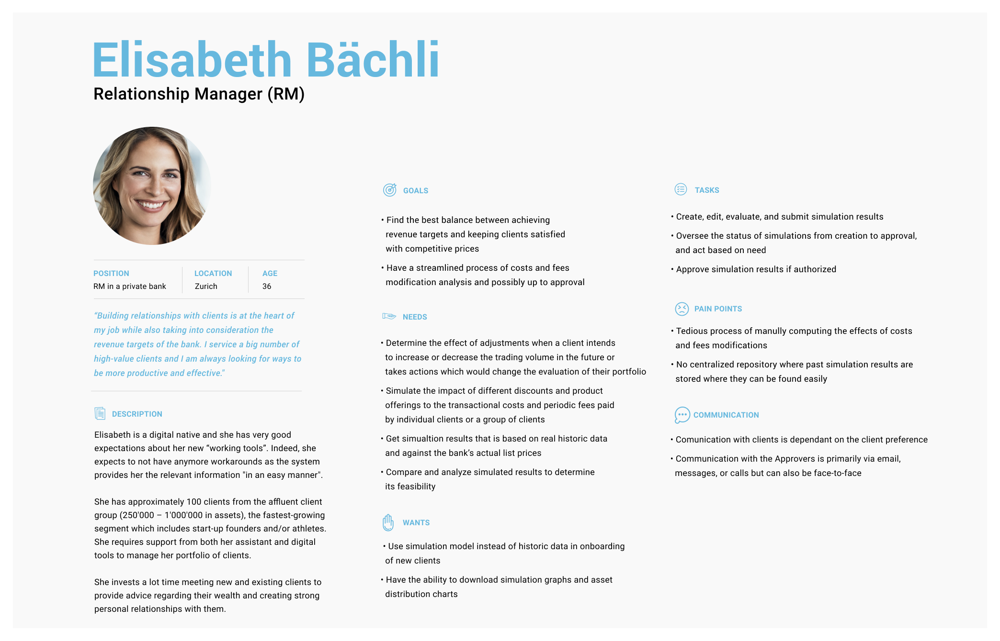
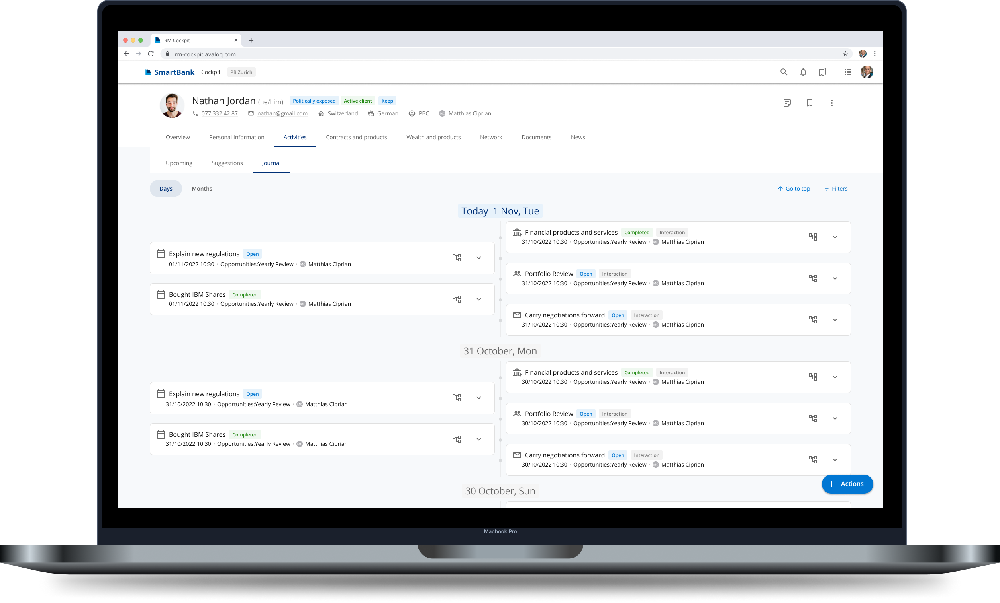
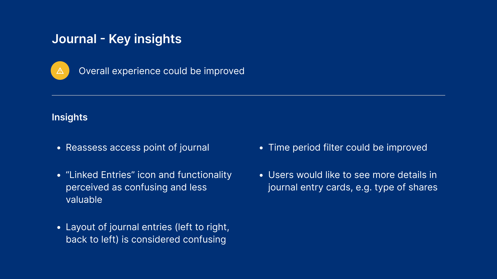
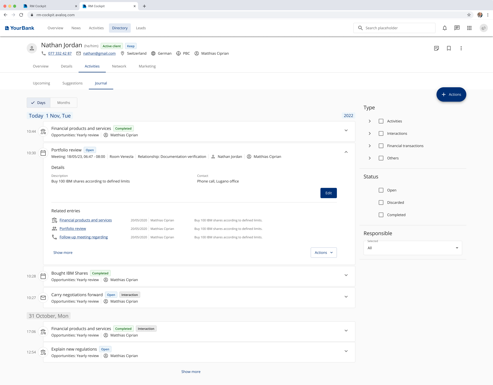

# Journal

> This case study will show the new functionality of a 'journal' that was added tot the appliction for Relationship Manager in banks. 

## About the project
A new functionality was going to be added within the application that Relationship Managers (RM's) in banks would use. Within this new feature ('the journal') the RM would have a full overview of all the activities related to this client. 
I was a UX/UI Designer in this project and therefore responsible for the following:

- Gather and analyse requirements from existing personas and stakeholders
- Present concepts in client meetings and gather feedback
- Create userflows and wireframes
- Create high-fidelity screens and prototypes
- Set-up and support in user testing
- Align designs with Design System
- Hand-over designs to developers

## Requirement and design phase
In order to define the requirements for the new functionality, I gathered information about our end-users form existing Persona's. There were meetings together with Product Managers and Product Owners to gather insights and requirements. Besides this, we held workshops with the client to refine the requirements, get client input and get feedback on concepts and ideas. 

Based on all the information and requirements acquired we created user stories. With these user stories we would create a concept and present this again to all stakeholders to validate and refine them. 

In addition to this, we made sure to keep in touch with the developers to check on the feasibility of the designs. 

Example of a Persona

After several iterations we created a final concept that we would take to the next phase of testing with our end-users. 

Extract of final concept

## Usability testing
The usability test was a moderated, task-based usability test with our end-users. To prepare for the usability test I created a hifgh-fidelity prototpye and we used the user stories that were created in the requirement phase to set up our task-based usability test. 

### Results
A presentation with all the insights and results of the usability test was created. This gave us some clear insights in where the designs needed to be improved and adapted. 

Extract of results

With these insights we redesigned the journal:

|Result|New design|
|:-------------|:-------|
|"Related entries" icon perceived as confusing and less valuable|Deleted the icon and showing a preview of related entries in text|
|Layout of journal entries is considered confusing|Adapted the layout so that all entries are shown horizontally|
|Time period filter could be improved|Adapted filters and with the adapted layout they could always be shown|
|Users would like to see more details in the journal entry cards|Expanded the information on the expaned journal entry card|

Here you can see an example of one of the adapted designs after the usability testing:

Extract of design after usability testing
