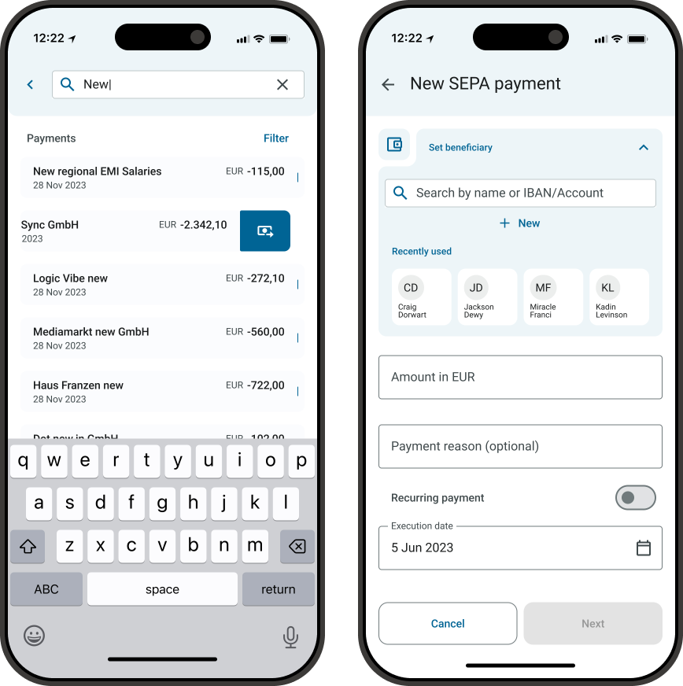
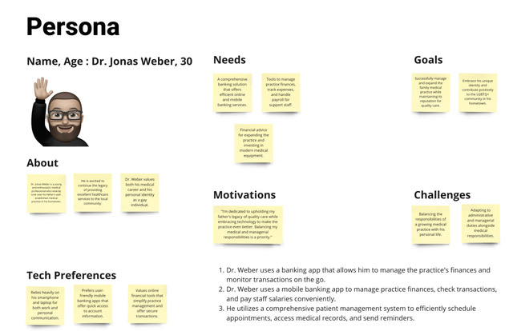
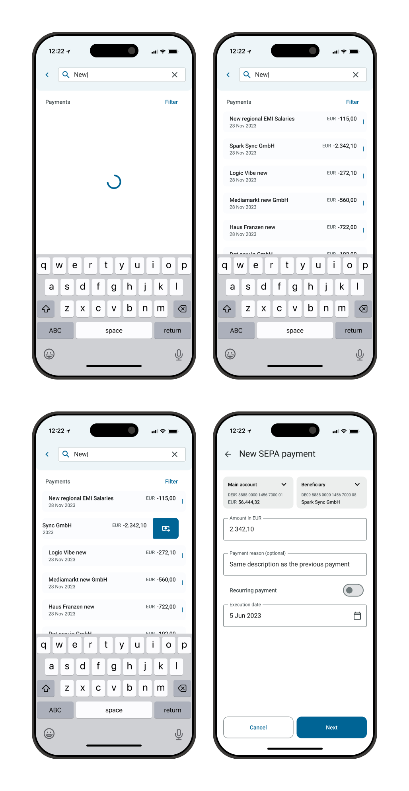
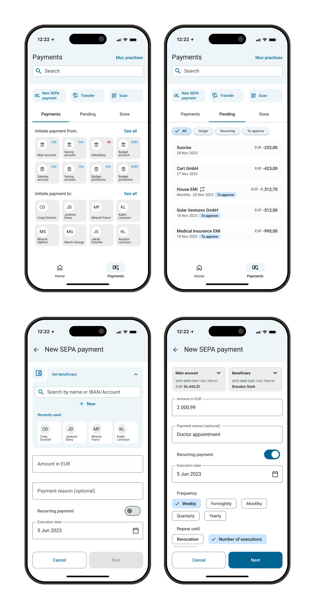
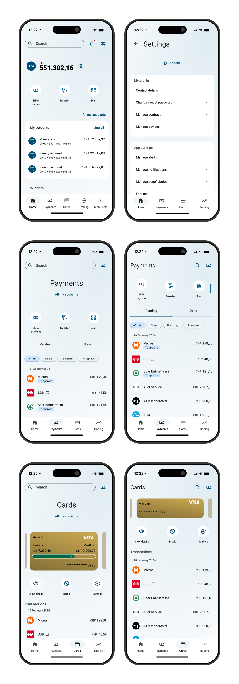

# Mobile Banking App

> Creating a new and modernized mobile banking application.

## About the project
This project contains the complete reworking and modernizing of an existing mobile banking application. A user-centered design driven approach was used which consisted out of an ideation phase and a solution phase.

When I entered the project, a first round of ideation and solution were done, but these steps were to be continuously repeated to improve the solution and make sure the user needs were met.

My responsibilities in this project were:

- Competitive analysis and research
- Research about latest mobile UX standards and patterns
- Ideation
- Check and gather requirements with other stakeholders (Product Management, Product Owner, Developers and Client)
- Design mobile banking app screens
- Secure an MVP status of the solution including a smooth hand-over to developers
- Create and maintain Native Mobile Design System, including theming possibilities (view “Design System” use case for more information)

In this use case I will highlight two flows (Search and Payment flow) and rework on the general UI/UX of the application.

One of the challenges in this project is that the new mobile banking app needs to cater for a wide range of end-users; ranging from business owners to everyday consumers. For this, persona’s were created to get insights in the goals and needs of the end-users. Also a constant collaboration with all stakeholders to check upon the requirements was ensured.

Besides that, the new mobile banking app has a dependency on legacy code that requires creative solutions to get to the best experience for the end-user.

Example of one of the persona's

## Search and Payment flow
Please view below the examples of UI/UX designs for the MVP stage of the Search flow and the flow for making a Payment.

### Search
For the MVP version of the new mobile banking app we needed to secure the first version of the Search. In this first stage it would support only search for Payments, but the search needed to be flexible enough to be expanded in the future to a global search to be able to search for more items throughout the application.

To get to the best result this design was iterated with the different stakeholders to ensure technical feasibility and that all requirements were met.

I was also responsible for creating the components needed in the Design System and making sure consistency was achieved throughout the whole application.

Extract of the search flow

### Payment
For the MVP version of the new banking app the payment flow needed to be simplified compared to the payment flow available on the web version. For this payment flow; the requirements necessary were brought back to a limited payment flow that would support the end-user without overcomplicating the flow. This was done in collaboration with Product Management, Product Owner and client feedback.

Next to ensuring a hand-over to the developers, I was also responsible for creating the components needed in the Design System and making sure consistency was achieved throughout the whole application.

Extract of payment screens

## UX/UI Rework
During this project there was a continuous cycle of iterations which led to continuous improvements of the UX/UI of the application. To improve the general look and feel of the application after feedback that there was an information overload in some screens, it needed more consistency and it needed to look more modern we did some explorations to improve on these areas.

### Explorations and wireframes

After an initial phase of exploration and competitive analysis I was responsible for new ideas to reorganize the application. I started this process with creating wireframes, to turn those into more detailed UI solutions later.

See below the list of feedback that was collected with a potential solution next to it. This was then turned into wireframes which went through several iterations with the different stakeholders to gain feedback and improve on it.

 |Feedback|Solution|
 |:-------------|:-------|
 |Crowded home screen|Home screen which uses widgets so the end-user can configure it himself|
 |Inconsistencies|Create standardized framework for header and define navigation patterns|
 |Application does not look modern enough|Improve the UI by e.g. creating more breathing space and adding a gradient background|

Extract of new mobile design explorations