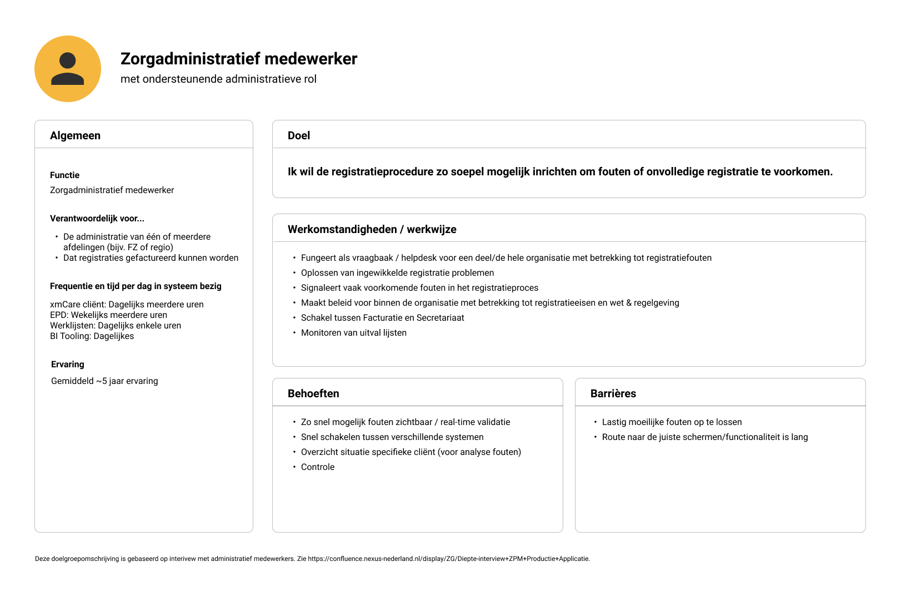
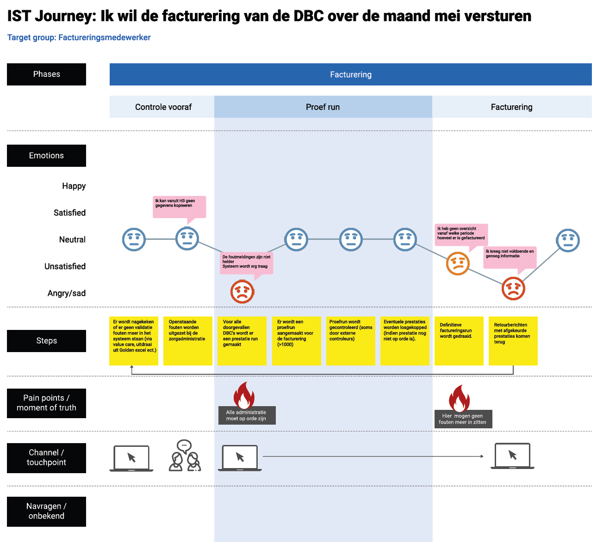
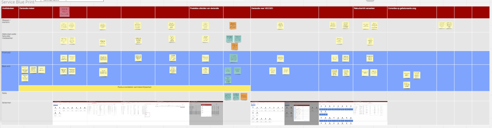
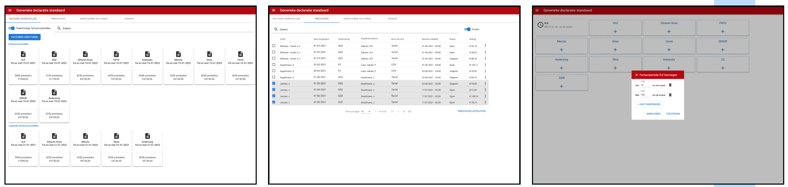
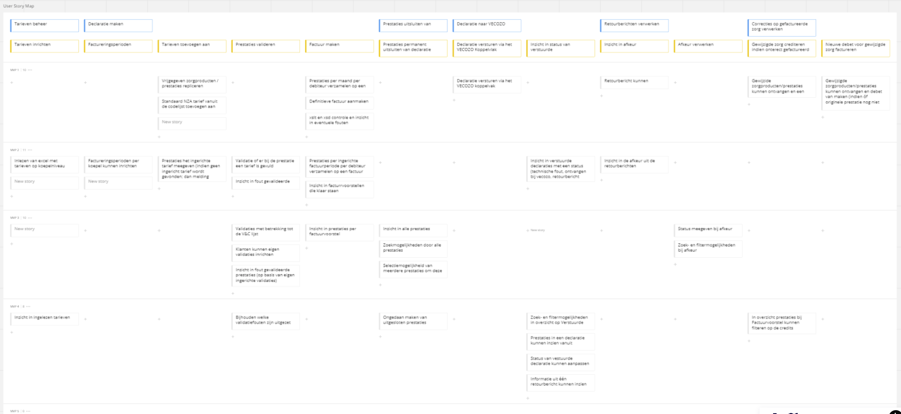

# Healthcare

>With the introduction of ZorgPrestatieModel (ZPM), a new law for time registration in mental healthcare
institutions, two new stand-alone web applications needed to be designed.
Within a
 multi-disciplinary team we created the solution existing out of two new web applications that were needed
  for
 production[^1] and billing.

## About the project
I was the Product and UX Designer and therefore responsible for the following:

- Analyzing law & regulation
- Analyzing current system
- Led user research
- Created and validated concept
- Defined user stories for the team
- Participated in writing features
- Cared for the consistency and quality of the application

The complexity of this project was that there was a tight deadline given by law & regulation and that a lot of work had to be distributed among many different teams. On top of that, there were dependencies to a legacy system and to clients with a differently configured set-up of our software.
Creating a shared understanding with and among many teams next to defining a clear MVP was crucial in this project to make the deadline.

## Research
I led the user research for this project that eventually lead to the creation of persona’s and customer journeys. For the user research we interviewed ten different end-users spread out over 5 different healthcare institutions who were all using our software.
This research gave us new insights about the different needs and pain points of the end-users and helped in defining a concept fitting to the users needs.

### Persona’s

With the results of the research we were able to create three different persona’s:

1. Secretary employee
2. Administrative employee
3. Billing employee

Extract of the persona of an Administrative employee

### Customer journey
With the information gained in the user interviews, we were able to create an IST and a SOL customer journey for each persona. This gave us insight in where the end-users were experiencing pain points that gave us the opportunity to enhance those in the new solutions.

Example of the IST customer journey for the billing employee

### Challenges
 |Challenges|Solutions|
 |:-------------|:-------|
 |Little availability to gather information from users of our system|Reached out to the available contacts to create a group of users among all customers|
 |Current system is very configurable; no standard use among all users|Interviewed users several times to create an understanding of shared pain points|
 |Little knowledge within our teams of how our system is currently being used|Little knowledge without our teams of how our system is currently being used|

 [^1]: In healthcare institutions the term 'production' refers to converting the registration of the spend time by
 healthcare professionals to their correct and corresponding products, which can then be billed according to law and
 regulation.

 ## Concept
 After the research I led the concept creation for the new web-applications. This was done within a multi-disciplinary team and needed to work with complex requirements from laws and regulation, but also fit upon legacy systems.

 ### Service Blue Print

 I led and prepared the workshop with the multi-disciplinary team to create a Service Blue Print. This Service Blue Print gave us insight in the different use-cases the users needed to be able to perform and which actions and functionalities were needed. Together with the team we added what both the front- and the back-end should be able to execute.
 The Service Blue Print helped us define the new application and helped in getting a common understanding of the new application among all different team members, but also stakeholders outside of the team.

Service Blue Print

 ### Prototype

 I created a clickable prototype in Figma which took the Service Blue Print as a basis.
 The clickable prototype was validated and tested with our end-users again and updated according to their feedback.

A few extracts of the first version of the prototype

 ### Challenges
  |Challenges|Solutions|
  |:-------------|:-------|
  |Getting the teams, including developers, involved in creating the solution|RSet up a workshop with the team to create the Service Blue Print, which also included technical concepts|
  |Validating the concept and prototype with actual users|Validated the prototype with the newly formed group of users|
  |Finding an internal support base for the Concept among several different teams which were going to build the solution|Shared the Concept, Service Blue Print and prototype with the teams, Product Owners and Product Manager to create a shared internal vision|

  ## Implementation

  In order to make the deadline; the implementation was divided by many different teams and we defined a clear MVP. I created an extensive Story Map which helped establish the MVP (and the releases after that). The Story Map defined the different features and functionalities needed and this was used to help distribute the work among the teams.

  In the implementation phase, I was responsible for analyzing more detailed requirements. I created the screens and wrote the user stories for the team. I led the weekly refinements with the team and I cared for the consistency and quality of the implementation which was distributed among different teams.

User Story Map of the project

### Challenges
|Challenges|Solutions|
|:-------------|:-------|
|Limited time and hard deadlines for delivery|Created Story Map to define the absolute minimal viable product with which our clients could start working|
|Implementation was distributed among different teams, with many team members having little knowledge about the project|Repeatedly referred back to the created persona’s, concept and service blue print to maintain a common understanding of the solution and implementation among the teams.|
