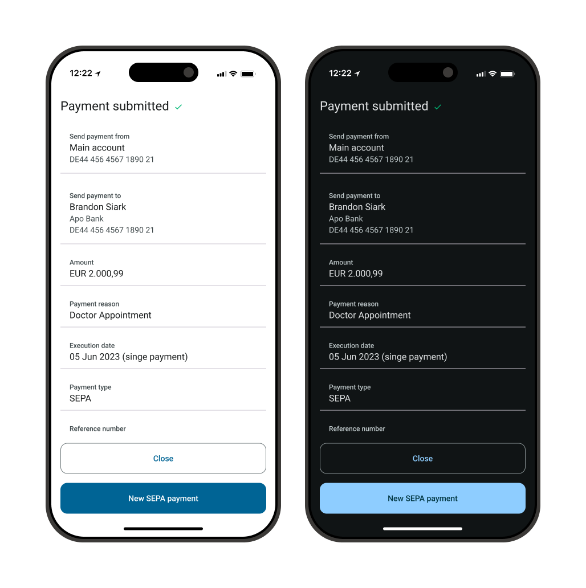
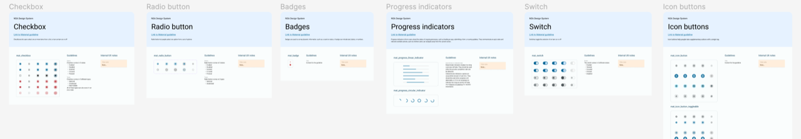
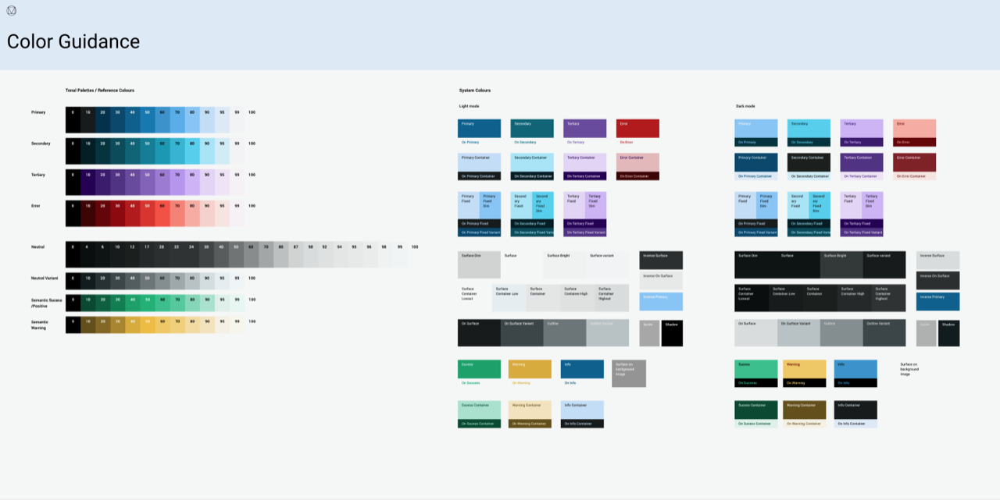
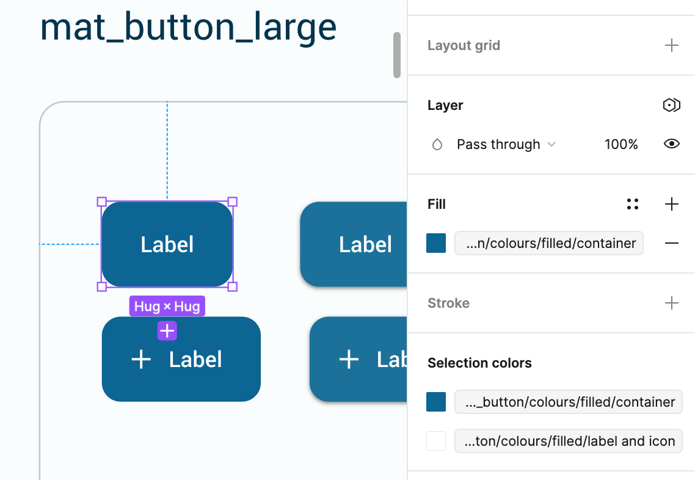
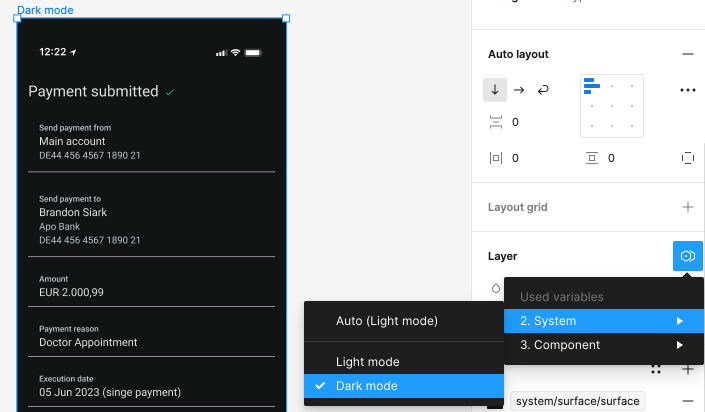

# Design System

> I have always been an advocate of using a Design System because of the consistency, user-friendlyness and efficiency that it brings. I have advocated the use of a Design System by supporting fellow designers in using Design System components, but also sharing the advantes of a Design System with all different stakeholders within the company. Both at NEXUS Nederland and at Avaloq I have been part of creating and maintainging Design Systems. In this use-case I will mostly focuss on the creation of the new Native Mobile Design System at Avaloq. 

Example of light and dark mode supported by design system components

## About the project
I was responsible for creating and maintaining a new Native Mobile Design System, based on the new Material 3. This design system was to be used in all new mobile applications. The responsibilities and requirements that this entailed were:

- Create and organize a new Figma set-up for the Mobile Design System
- Create Design Tokens which should support Light and Dark mode, as well as theming for clients
- Create new components in Figma, either based on Material 3 or custom components if needed
- Add and create guidelines and documentation
- Hand-over and support developers who were implementing the Design System

Extract of Design System components

## Design tokens and theming
Using the Figma Variables functionality I implemented a design token system that we used throughout the design system.

The design tokens were based on Material 3, meaning the color system is derived from what Material 3 offers with their theme building tool and the set up and naming of the design tokens is based on what Material offers and uses in their components.

The design tokens existed out of the following levels:

- Reference tokens
- System tokens
- Component tokens

Extract of Design Tokens

### Reference tokens
The reference tokens are the ‘base’ tokens. These includes the color palettes, but also e.g. different spacings values or corner-radius values. Reference tokens itself are never used in components or designs.

Example: ref-colours-primary-40 with the corresponding hex value

### System tokens
The system tokens are the next level and give a meaningful name to the reference token. A system token always refers to a reference token. On this level the Light and Dark mode were defined.

Example: sys-colours-primary with a corresponding reference token for Light mode and a corresponding reference token for Dark mode.

By creating a new mode for a specific client; theming can be defined here. E.g. a client’s theme needs corner-radiuses to be 0 everywhere. Changing the sys-corner-radius tokens to the ref-corner-radius-0 will give this effect on all components and screens.

### Component tokens
The component tokens are the last level and always refer to another system of reference token. Component tokens can ensure client’s theming on a component level.

For example; instead of changing the primary color in the complete application, the theme only needs the button-component to have a different color from the primary color, without changing the primary color in other places in the application. This can achieved by using a the comp-mat-button-colour-filled-container in the button component. By changing the value of this token; the color of only the button will change in the application.

Example of component using Component Tokens

### Example: Light and dark mode
One example of using the Design System and the Design Tokens is for a light and dark mode. With the Design Tokens, you define for every System Token a light mode version and a dark mode version. Then, when you're screen is build up out of components from the Design System which are using the Design Tokens; you can easily change the mode of the screen which transforms the entire screen from the defined light mode to the defined dark mode. View the example below with a submitted payment screen. 

Example setting a dark mode in Figma

Example of light and dark mode